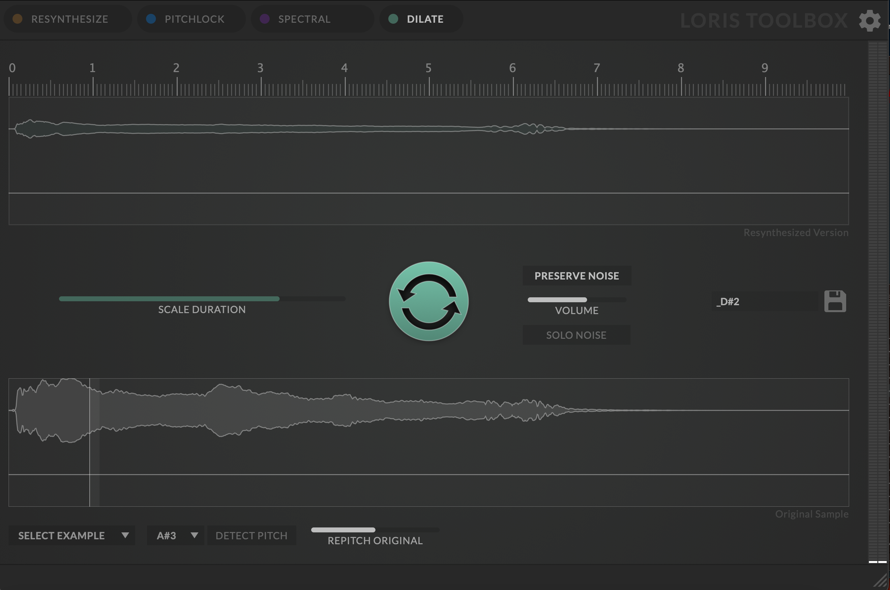

# loris-tools

A collection of sample analysis tools for HISE based on the Loris library. The [Loris library](http://www.cerlsoundgroup.org/Loris/) allows you resynthesize and morph audio data and is a pretty powerful tool. This repository contains the integration of Loris into [HISE](https://github.com/christophhart/HISE/)! The integration features:

- a prebuild dynamic library (currently only macOS, but Windows & Linux will follow soon)
- a scripting API to control loris functions using more or less the same API as the command line interface.
- integration into all file management tools in HISE: audio file loading, script Buffer support etc.

The repository contains three projects:

## Loris Toolbox

A HISE Project that demonstrates how to use the Loris library with the scripting layer. It can be compiled to a standalone app, making it a GUI interface for the most important functions of Loris!

## loris_library

A dynamic library wrapper that encapsulated the calls into Loris through a C-only API interface. If you want to use Loris in HISE, just grab the latest build and put it in the HISE app data directory. 

## loris_test

A simple JUCE C++ app that's only reason of existence is prototyping the API without recompiling the big ol' HISE everytime. You probably will never need to use this.

